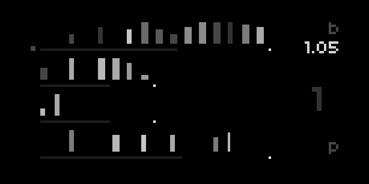
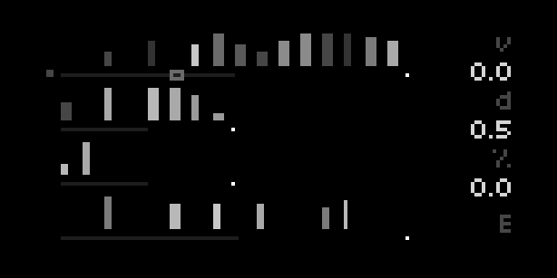
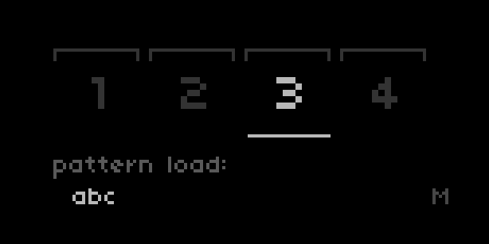
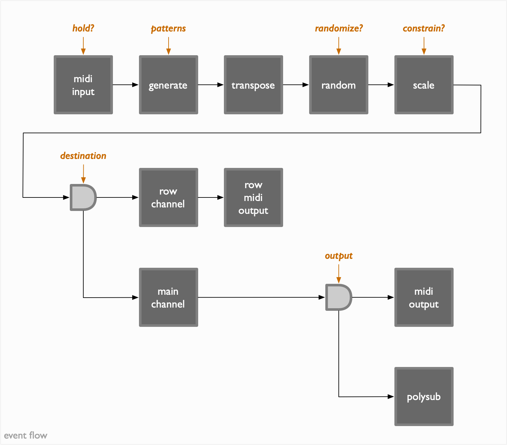

# tambla

[tambla](https://github.com/ngwese/tambla) is a semi-generative rhythmic
arpeggiator with bendable playheads

requirements:
- **norns** (20mmdd or later)
- **midi keyboard** - for note input, preferably with velocity sensitivity
- **midi controller** (encouraged) - for mapping performance parameters to dedicated
  controls

pairs well with:
- multi-channel MIDI-CV converters
- (one or more) velocity sensitive polyphonic MIDI sound sources
- delays
- clock synchronized setups

## overview

tambla is tool to explore polyrhythms and syncopation. patterns consist of four
rows. rows have 2-16 triggers with velocity, duration, and chance values per
step. holding down a key generates notes at the given pitch
with the trigger pattern in the first (top most) row. each subsequent key held,
begins generation based on the trigger pattern in next lower row. note generation
begins from the current playhead position instead of the beginning of the row
ensuring the overall rhythmic structure is maintained.

the four playheads scanning each row are synchronized to a common clock.
individual rows can divide down the clock for linear phasing effects or bend the
clock or both. bend values < 1.0 result in the playhead progressing in a
logarithmic fashion (fast then slowing down) where as bend values > 1.0 result
in exponential progression (slow then speeding up).

## interface

the tambla ui consists of three pages in addition to a number of mappable
parameters exposed in the _norns_ menu.

the **play** page is displayed when the script starts. conceptually the pages
are laid out horizontally. several controls are common across all pages:

| control | purpose |
|---------|---------|
| `K1 + K2`   | move left through the pages |
| `K1 + K3`   | move right through the pages |
| `ENC1`      | horizontal selection within the page |
| `K1 + ENC1` | vertical selection within the page |

### play page

the **play** page, designated by the `P` in the lower right corner, shows the
four rows of the pattern in the currently selected **slot**. parameters which
affect an entire row can be manipulated on this page.

| control | purpose |
| ------- | ------- |
| `ENC1`  | select the active pattern slot |
| `K1 + ENC1` | select the row to adjust parameters for |
| `K3 + K2` | randomize all rows (key press order is important) |
| `ENC2` | select the row parameter to edit |
| `ENC3` | adjust parameter value |

below each row is a horizontal bar which shows the current playhead position for that row.

_the currently selected row_ is indicated by the small square box to the left of
the row's playhead indicator.

_the currently selected slot_ is indicated by the large number in the middle
right of the display (slot `1` is selected in the image above).

the upper right corner shows the currently selected/editable row parameter.

| code | parameter | purpose |
| ---- | --------- | ------- |
| `b` | bend | playhead time bending. values < 1.0 result in logarithmic progressing, values > 1.0 result in exponential progression |
| `o` | offset | step offset for playhead (not currently visualized) |
| `r` | rate/divisor | divide down the clock, 4 is the minimum and default. 8 is half speed, 16 quarter speed |
| `n` | length | number of steps in the row |

### edit page

the **edit** page, designated by the `E` in the lower right corner, allows per
step editing of the triggers in the current pattern.

triggers are visualized as vertical bars above the playhead indicator. the
height of the bar indicates the trigger _velocity_ (`v`), the width the trigger
_duration_ (`d`), and the brightness the trigger _chance_ (`%`).

just as with the **play** page the currently selected row is indicated by the
small box to the left of the row playhead.

_the currently selected step_ is indicated by the small open rectangle on top of
the playhead bar.

| control | purpose |
| ------- | ------- |
| `ENC1`  | select step within the row |
| `K1 + ENC1` | select the row |
| `K3 + K2` | randomize _the selected row_ (key press order is important) |
| `K2 + K3` | clear _the selected row_ (key press order is important) |
| `ENC2` | adjust step velocity |
| `ENC3` | adjust step duration |
| `K2 + ENC2` | adjust step chance |

**note:** the trigger at a given step is consider off if either the velocity or the chance
values are zero.

### macro page

## structure

- slots
- rows
- routing

## parameters

additional parameters not shown as part of the main interface can be accessed in
the [**PARAMETERS**](https://monome.org/docs/norns/play/#parameters) section of
the norns menu.

the **tabla** parameters are split into three sections

### `tambla`

the initial set of parameters control the note generation and transformation logic

| name | details |
| ---- | ------- |
| active pattern | the currently selected/playing slot |
| chance | when on chance is considered when determining if a trigger should fire (defaults to off) |
| chance boost | added to trigger chance values when determining if a trigger will fire. chance boost of 1.0 has the same effect as turning chance off |
| velocity mod | when on trigger velocity is scaled by incoming note velocity |
| length mod | when on trigger duration with affect generated note duration |
| input hold | when on incoming notes are held after release, additional notes accumulate as long as at least one key is held down continuously. after all keys have been released the next key press will start another accumulation |
| transpose | shift notes post generation up or down by semitones |

#### `random >`

| name | details |
| ---- | ------- |
| randomize pitch | when on a randomized offset is added to the pitch of generated notes |
| choice | _TODO_ |
| scale | _TODO_ |
| sign | whether to add, subtract, or randomly choose the direction of pitch offset |
| chance | likelihood of pitch being randomly offset |

#### `scale >`

| name | details |
| ---- | ------- |
| constrain to scale | whether to map transposed and randomized notes into a specific scale |
| scale | name of the scale |
| root | lowest (midi) note/root of the scale. notes below the root are mapped to the root note |
| octaves | number of octaves above root to allow. notes above the highest note are mapped to the highest note in the allow range |

### `tambla: rows`

several parameters for each of the four rows are exposed to allow mapping as
performance controls. the parameters affect rows of _the currently selected
slot_.

| name | details |
| ---- | ------- |
| bend | playhead bend value |
| n | row length |
| res (aka `r`) | the rate/divisor of the clock for this row |
| offset | the step offset for the row |
| destination | selects whether generated notes from this row flow out the _main_ output or the alternate midi _row output_ |
| midi output | midi device number; see `SYSTEM > DEVICES > MIDI` |
| midi output channel | channel number for notes generated by this row |

### `tambla: i/o`

parameters in the third section control the main midi inputs, outputs, and
output destination.

| name | details |
| ---- | ------- |
| midi input | midi input device number; see `SYSTEM > DEVICES > MIDI` |
| midi output (main) | main midi output device number; see `SYSTEM > DEVICES > MIDI` |
| midi output channel | channel number for notes passing through the main output |
| output | _midi_ or _polysub_ |
| output logging | turn on debug logging for generated notes visible in the _maiden_ REPL. may cause problems with fast clocks and dense trigger patterns |

**note:** the initial unmarked set of parameters belong to the `polysub` engine and the
second unmarked set are from the `halfsecond` library. neither of these is
heavily utilized and may be replaced in the future.